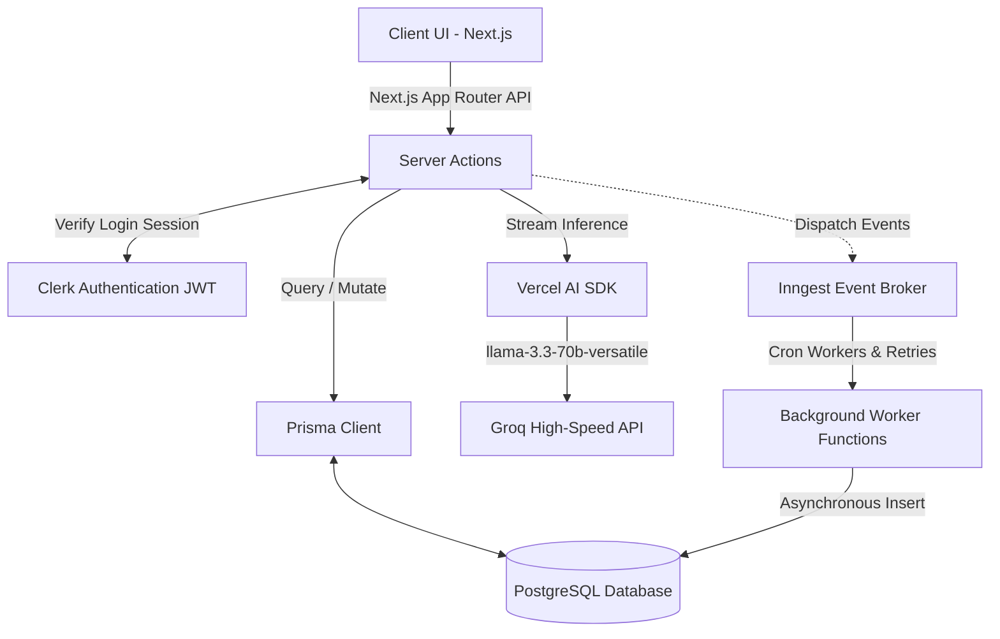

# 1. Home (Project Overview)

**Project Title:** Disha AI  
**Team Members:** Dhruvi Jain, 2400297, [https://github.com/dhruvi-git](https://github.com/dhruvi-git)  
**Guide / Faculty Name:** Dr. Yogesh Jadhav  
**Project Domain:** AI, Web Dev  

**Short Description:**  
Disha AI is a comprehensive Full-Stack AI-powered career coach designed to help professionals logically optimize their resumes, rigorously prepare for mock interviews, and dynamically explore real-time industry insights. It strategically uses advanced LLMs (via Vercel AI SDK and Groq) coupled with background workload processors (Inngest) to deliver seamless, actionable advice to users.

**Problem Statement:**  
Modern job seekers face an overwhelmingly convoluted array of career choices, heavily compounded by generic guidance systems that fail to account for unique technical aptitudes and aggressively shifting job markets. Traditional programmatic career counselors struggle to keep pace with micro-skills required in the modern tech landscape. This gap creates a critical need for a dynamic, highly personalized, low-latency advisory execution tool.

**Objectives:**  
Leverage advanced Generative AI and event-driven background processing to design an innovative solution acting as a hyper-personalized career and skills advisor. The platform must circumvent generic advice by mathematically aligning a user's bespoke profile to relevant market benchmarks, offering detailed remediation and interview validation natively on the web.

**Key Features:**  
- **Industry Insights Dashboard:** Generates robust, asynchronous, real-time data on salary bands, high-demand skills, and market mobility within specific industries using Inngest background jobs.
- **AI Resume Builder:** Empowers users to architect, save, and iterate upon ATS-compliant resumes with AI quantifying their professional impact.
- **Mock Interviews:** Dynamically constructs adaptive multiple-choice quizzes encompassing technical/behavioral domains based exactly on user competency.
- **Smart Cover Letter Generator:** Synthesizes context-aware cover letters mapping background experience to JD prerequisites instantly.

---

# 2. Introduction

**Background of the Project:**  
With exponential shifts in global employment vectors specifically driven by automation, static academic curriculums consistently lag. Students enter the workforce lacking localized insights into what skills practically yield employability.

**Motivation:**  
Driven by the democratization of robust Language Models (LLMs), there exists a massive opportunity to provide 1-on-1 equivalent career mentoring at zero marginal cost.

**Existing System:**  
Candidates traditionally rely on collegiate placement cells, non-specific internet articles, or cost-prohibitive private consultants. Standard portfolio platforms only aid in formatting, lacking strategic generation capabilities.

**Limitations of Existing Systems:**  
1. **Static Responses:** Unresponsive to micro-trends in emerging tech.
2. **Synchronous Bottlenecks:** Web applications freeze while generating heavy reports.
3. **Impersonal Feedback:** Rubric-based assessments fail to explain *why* an interview answer was poor.

**Proposed Solution:**  
Disha AI implements an event-driven AI architecture. It offers a continuous feedback loop: assessing a user's skills via mock interviews, formatting their experiences into high-impact resumes, and orchestrating extensive industry analysis workflows silently in the background (using Inngest), maintaining a snappy, uninterrupted user experience.

---

# 3. Objectives & Scope

**Project Objectives:**  
- Synthesize an integrated platform aligning student capabilities to real-world market demands via LLM evaluation.
- Construct native document builders explicitly targeting ATS compliance.
- Architect an automated, stress-tested interviewing loop generating deterministic feedback over non-deterministic LLM pipelines.

**Scope of the Project:**  
Focuses prominently on college students and early-stage professionals aiming for software engineering, data science, digital marketing, and UI/UX disciplines.

**Applications / Use Cases:**  
- A backend engineering aspirant utilizing the Mock Interview module to drill system design paradigms.
- A career switcher generating tailored Cover Letters dynamically mapped to individual startup job descriptions.

---

# 4. Literature Survey / Related Work

**Summary of Research:**  
1. *Contextual AI in Education:* Focuses on using RAG and System prompting to narrow broad foundational models to specialized advisory roles.
2. *Event-Driven Architectures for AI Data:* Analyzes utilizing message queues and serverless brokers (Inngest/Kafka) to manage asynchronous LLM generation latency without starving web clients.
3. *Automated Resume Parsing & ATS Metrics:* Evaluating traditional regex-based parsers versus modern semantic LLM parsers.

**Existing Tools/Technologies:**  
- **ChatGPT / Claude via Web:** Highly powerful, but lacks integrated workflows or persistent schema storage for repeated iteration.
- **Novoresume / Zety:** Exceptional visual builders but missing generative contextualization. Disha merges these paradigms.

---

# 5. System Architecture

**Architecture Diagram:**  



*(Please commit the rendered version of this mermaid chart as a `.png` for the final repository)*

**Explanation of Architecture:**  
The application uses Next.js 15 Server Components and Server Actions. Core mutations connect directly to a PostgreSQL database via Prisma ORM. Crucially, the platform decouples synchronous AI operations (like real-time chat/feedback leveraging Vercel AI SDK and Groq) from asynchronous heavy jobs (like weekly industry insight aggregation) which are delegated to Inngest for fault-tolerant execution.

---

# 6. Technologies Used

**Frontend & Framework:**  
- Next.js 15 (React 19)
- Tailwind CSS & Shadcn UI
- Framer Motion (Micro-animations)
- React Markdown & UIW MD Editor

**Backend & Data Services:**  
- Next.js Server Actions (Internal API)
- Prisma (Type-safe ORM)
- PostgreSQL (Primary Datastore)
- Clerk (Authentication Provider)

**AI & Background Infrastructure:**  
- Vercel AI SDK (Unified AI framework wrapper)
- Groq (`llama-3.3-70b-versatile` - Sub-second LPU inference)
- Inngest (Serverless queues and CRON workflows)

---

# 7. Methodology / Working

**Step-by-step working of system:**  
1. **Secure Onboarding:** Clerk manages SSO. Users supply an initial skill vector and target industry on the onboarding screen.
2. **Data Orchestration:** Upon onboarding, an event is emitted to Inngest. Inngest workers quietly aggregate complex industry data in the background and insert it into Prisma, keeping the UX fluid.
3. **Resume Formulation:** Utilizing `pdf-parse`, existing resumes can be introspected. Generative AI strictly outputs ATS-compatible metrics mapped to JSON schemas requested via Groq.
4. **Interview Loop:** When a user initiates testing, the server dynamically prompts the AI to branch difficulty based on previous question performance.

---

# 8. Implementation

**Project setup steps:**  
```bash
git clone https://github.com/dhruvi-git/disha.ai.git
cd disha.ai
npm install
# configure .env variables
npx prisma generate
npx prisma db push
# Terminal 1
npm run dev
# Terminal 2 - Start Inngest local relayer
npx inngest-cli@latest dev
```

**Code Structure:**  
- `/app` - Route Segment definitions, UI layouts, page boundaries.
- `/actions` - Server-side RPC methods executing direct database/AI logic.
- `/components` - Modular visual atoms.
- `/lib` - Core utility instantiations (Prisma client, Inngest client).
- `/app/api/inngest` - Hosted Inngest worker endpoint polling for queue jobs.

**Integration details:**  
By utilizing `@ai-sdk/groq` wrapped within `@ai-sdk/react`, the application seamlessly streams AI responses to the DOM. Inngest natively binds to API routes (`/api/inngest/route.js`) ensuring arbitrary compute scaling for backend insight polling.

---

# 9. Results & Output

**Performance Metrics:**  
- **Time to First Token (TTFT):** Exceptionally low (< 600ms) by targeting Groq's specialized inference hardware.
- **Worker Reliability:** Inngest achieves essentially 100% execution guarantees for critical data refreshes with native exponential backoff and retry behavior.

*(Insert Screenshots of Output Data / PDF Renders Here)*

---

# 10. Challenges & Limitations

**Problems faced during development:**  
- **Context Window Management:** Preventing JSON truncation from LLMs outputting highly detailed mock interview question sets. Modulating system prompt verbosity resolved this.
- **Stateful Background Jobs:** Initial serverless timeouts occurred when attempting to run heavy insight generation linearly. Refactored architecture to adopt **Inngest** for detached async execution.

**Limitations of the system:**  
- Reliance heavily on prompt stability. Undocumented changes in LLM foundational intelligence might alter UI rendering logic if JSON schemas break.
- Current database implementations rely on relation models which scale well, but highly customized analytics might eventually require OLAP databases.

---

# 11. Future Scope

**Possible improvements:**  
- Native WebRTC Voice integrations directly streaming to speech-to-text models for verbal mock interviews.
- Full text embeddings using pgvector for ultra-precise job description matching.

**Extensions:**  
- Constructing a native mobile client via Expo fetching from the shared Next.js Server Components.

---

# 12. Conclusion

**Summary of work:**  
Disha AI successfully integrates disjointed modern paradigms—high-speed generative AI, robust relational data modeling, and asynchronous event-driven worker tasks—into a single, reliable application.

**Key learnings:**  
- Vercel AI SDK drastically normalizes iterating across different LLMs.
- Adopting Inngest early significantly avoids operational dread associated with managing custom Redis task queues.
- Combining strong typing (Prisma & TypeScript methodologies) directly into Server Actions virtually eliminates traditional API payload mismatch bugs.

---

# 13. References

**Documentation Links:**  
- [Vercel AI SDK](https://sdk.vercel.ai/docs)
- [Inngest Background Jobs](https://www.inngest.com/docs)
- [Next.js Documentation](https://nextjs.org/docs)
- [Groq AI Reference](https://console.groq.com/docs/)
- [Prisma ORM Docs](https://www.prisma.io/docs/)
- [Clerk Navigation](https://clerk.com/docs)

---

# 14. Demo

**Video demo link:**  
*(Please insert Youtube / Drive link here)*

**Screenshots or GIFs:**  
*(Please insert GUI, Inngest Dashboard, and Prisma Studio GIFs here)*
