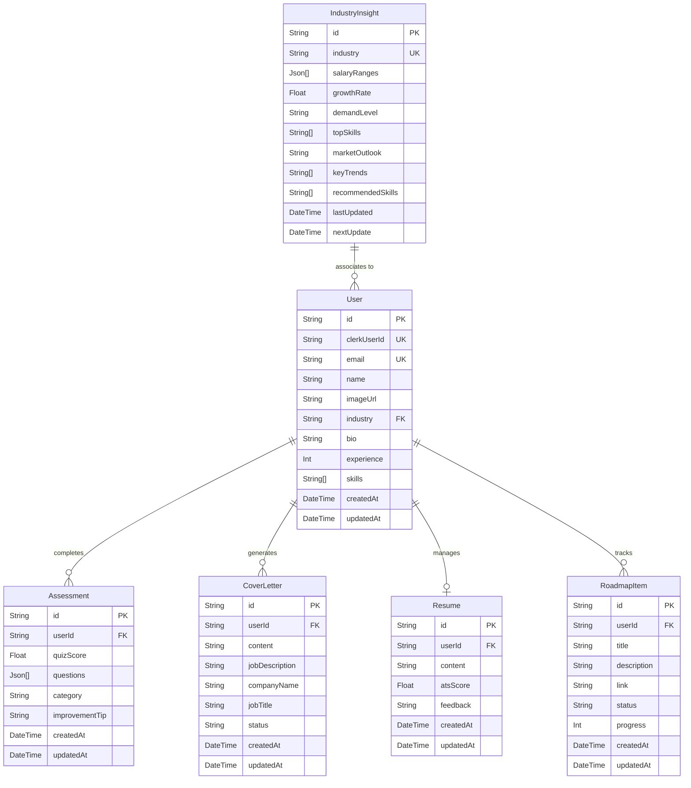

# 🚀 Disha AI - Intelligent Career Coach


Disha AI is an AI-powered career coach designed to help students and professionals optimize their resumes, prepare for interviews, and explore industry insights. By leveraging the high-speed **Groq API** with the **Llama 3 model**, Disha provides tailored and actionable advice. The platform features an intelligent chatbot, personalized roadmaps, and background automation via **Inngest** to ensure data processing scales effortlessly.

---

## ✨ Features

### 📊 Industry Insights & Analytics
Real-time data on salary ranges, trending skills, and job market trends for your chosen industry. Data is kept consistently updated through **Inngest** background cron jobs.

### 📄 AI Resume Tailor & Builder
- **Resume Tailoring** — Upload your resume, input a target job description, and instantly receive an **ATS Score**, tailored recommendations, and a fully customized resume aligned with that role.
- Write, refine, and save ATS-friendly base resumes. Auto-formats and exports cleanly to **PDF**.
- Get AI suggestions to quantify your professional achievements effectively.

### 🎤 Interview Progress & Analytics Dashboard
- **Mock Interviews** — Adaptive technical and behavioral multiple-choice questions tailored to your skills.
- **Analytics Dashboard** — Visually track interview progress over time: questions attempted, accuracy rates, and areas needing improvement.

### 💬 Personalized Career Chatbot
One-on-one conversations with Disha AI, deeply personalized based on your individual profile, industry, and skills — for career roadmaps, interview strategies, or general guidance.

### ✉️ Smart Cover Letter Generator
Instantly constructs tailored cover letters by contextually matching your resume experience with the requirements of a specified job description.

---

## 🛠 Tech Stack

| Domain | Technology | Purpose |
| :--- | :--- | :--- |
| **Frontend / UI** | React 19, Next.js 15 | React framework for robust UI and Server-Side Rendering (App Router) |
| **Styling** | Tailwind CSS, Shadcn UI | Utility-first CSS and pre-built accessible components |
| **Backend** | Next.js Server Actions | Type-safe server-side logic and API layer without a separate REST server |
| **Authentication** | Clerk | Secure login, signup, and session management |
| **Database & ORM** | PostgreSQL & Prisma | Relational database modeling and type-safe querying |
| **AI Engine** | Groq API (Llama 3) | Extremely low-latency inference for the chatbot and generation features |
| **Task Queue** | Inngest | Fault-tolerant event-driven background jobs and CRON tasks |
| **Deployment** | Vercel | Scalable, zero-configuration cloud hosting |

---

## 📐 System Architecture

This architecture outlines how the React client interacts with Next.js Server Actions, the database, and the external AI engine.

```
┌─────────────────────────────────────────────────────────────┐
│                    Frontend (React / Next.js)                │
│                    Client UI & Dashboard                     │
└──────────────────────┬──────────────────┬───────────────────┘
                       │ API Calls        │ SSO
                       ▼                  ▼
┌──────────────────────────┐   ┌──────────────────────┐
│  Next.js Server Actions  │   │  Clerk Authentication │
│      (Backend Layer)     │   └──────────────────────┘
└────┬──────────┬──────────┘
     │          │
     ▼          ▼
┌─────────┐  ┌──────────────────────────┐
│  Groq   │  │       Prisma ORM         │
│  API    │  └──────────┬───────────────┘
│ Llama 3 │             │
└─────────┘             ▼
                ┌───────────────┐
                │  PostgreSQL   │
                │   Database    │
                └───────────────┘
                       ▲
                       │ Async Data Inserts
              ┌────────┴────────┐
              │  Inngest Worker │
              │ (Background Jobs│
              │  & CRON Tasks)  │
              └─────────────────┘
```

> **Data Flow:** The UI calls Server Actions → Server Actions query Groq for AI responses and Prisma for data → Inngest workers run scheduled jobs (e.g. refreshing industry insights) asynchronously and write back to the database via Prisma.

---

## 🗄️ Database Design

The application's relational data model ensures data integrity across user records, assessments, generated documents, and background industry insights.



---


## 🚀 Getting Started Locally

### Prerequisites
- Node.js v18+
- Local PostgreSQL server installed and running
- API keys for Clerk, Groq, and Inngest

### 1. Clone & Install
```bash
git clone https://github.com/dhruvi-git/disha.ai.git
cd disha.ai
npm install
```

### 2. Configure Environment Variables

Create a `.env` file in the root directory:

```env
# ─── Database ──────────────────────────────────────────────
DATABASE_URL="postgresql://<username>:<password>@localhost:5432/<your_database>"

# ─── Groq AI ───────────────────────────────────────────────
GROQ_API_KEY="your_groq_api_key"

# ─── Clerk Authentication ──────────────────────────────────
NEXT_PUBLIC_CLERK_PUBLISHABLE_KEY="your_clerk_publishable_key"
CLERK_SECRET_KEY="your_clerk_secret_key"
NEXT_PUBLIC_CLERK_SIGN_IN_URL=/sign-in
NEXT_PUBLIC_CLERK_SIGN_UP_URL=/sign-up
NEXT_PUBLIC_CLERK_AFTER_SIGN_IN_URL=/onboarding
NEXT_PUBLIC_CLERK_AFTER_SIGN_UP_URL=/onboarding

# ─── Inngest (Background Jobs) ─────────────────────────────
INNGEST_SIGNING_KEY="your_inngest_signing_key"
INNGEST_EVENT_KEY="your_inngest_event_key"
```

> **Where to get these keys:**
> - **Groq** → [console.groq.com](https://console.groq.com)
> - **Clerk** → [dashboard.clerk.com](https://dashboard.clerk.com)
> - **Inngest** → [app.inngest.com](https://app.inngest.com) → your app → **Manage → Keys**

### 3. Initialize the Database

Push the Prisma schema to your local database:

```bash
npx prisma generate
npx prisma db push
```

### 4. Run the Development Servers

**Terminal 1 — Next.js Application:**
```bash
npm run dev
```

**Terminal 2 — Inngest Worker:**
```bash
npx inngest-cli@latest dev
```

The application is now running at [http://localhost:3000](http://localhost:3000).

---

## 🔍 Inspecting the Database

Disha AI uses **Prisma Studio** to visually explore tables, manage records, and inspect entries:

```bash
npx prisma studio
```

Launches at [http://localhost:5555](http://localhost:5555).

---

## 📄 License

This project is for educational and portfolio purposes.