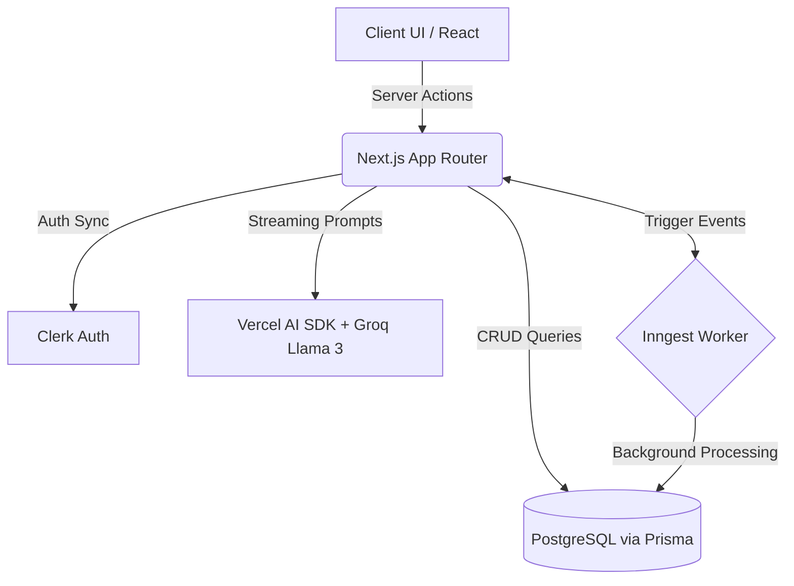

# 🚀 Disha AI - Intelligent Career Coach


Disha AI (formerly SensAI) is a Full-Stack AI-powered career coach designed to help professionals optimize their resumes, prepare for interviews, and explore industry insights. By leveraging the **Vercel AI SDK** with **Groq's Llama 3.3 model**, Disha provides high-performance, tailored, and highly actionable advice. Background automation powered by **Inngest** ensures reliable processing of data-intensive tasks at scale.

---

## ✨ Comprehensive Features

### 📊 Industry Insights & Analytics
- Provides real-time data on salary ranges, trending skills, and job market trends for your chosen industry.
- The data is kept consistently updated through **Inngest** background cron jobs.

### 📄 AI-Powered Resume Builder
- Write, refine, and save ATS-friendly resumes.
- Get AI suggestions to quantify your professional achievements effectively.
- Auto-formats and exports cleanly to **PDF**.

### 🎤 Dynamic Mock Interviews
- The application generates adaptive technical and behavioral multiple-choice questions tailored precisely to your registered skill set.
- Validates answers and delivers detailed AI-driven explanatory feedback on mistakes.

### ✉️ Smart Cover Letter Generator
- Instantly constructs tailored cover letters.
- Contextually matches your accumulated resume experience with the requirements of a specified job description.

---

## 🛠 Tech Stack

| Domain | Technology | Purpose |
| :--- | :--- | :--- |
| **Frontend/Backend** | Next.js 15 (App Router) | Full-stack React framework utilizing Server Actions |
| **Styling & UI** | Tailwind CSS, Shadcn UI | Utility-first CSS and pre-built accessible components |
| **Authentication** | Clerk | Secure login, signup, and session management |
| **Database & ORM** | PostgreSQL & Prisma | Relational database modeling and type-safe querying |
| **AI Engine** | Vercel AI SDK & Groq API | Extremely low-latency inference using `llama-3.3-70b-versatile` |
| **Task Queue** | Inngest | Fault-tolerant event-driven background jobs and CRON tasks |

---

## 📐 System Architecture



---

## 🚀 Getting Started Locally

### Prerequisites
- Node.js (v18+)
- Local PostgreSQL server installed and running (or use a cloud provider like Neon.tech/Supabase)
- API Keys for Clerk, Groq, and (optionally) Inngest.

### 1. Clone & Install
```bash
git clone https://github.com/dhruvi-git/disha.ai.git
cd disha.ai
npm install
```

### 2. Configure Environment Variables
Create a `.env` file in the root directory:

```env
# Database Configuration
DATABASE_URL="postgresql://<username>:<password>@localhost:5432/<your_database>"

# Groq AI
GROQ_API_KEY="your_groq_api_key_here"

# Clerk Authentication
NEXT_PUBLIC_CLERK_PUBLISHABLE_KEY="your_clerk_publishable_key"
CLERK_SECRET_KEY="your_clerk_secret_key"
NEXT_PUBLIC_CLERK_SIGN_IN_URL=/sign-in
NEXT_PUBLIC_CLERK_SIGN_UP_URL=/sign-up
NEXT_PUBLIC_CLERK_AFTER_SIGN_IN_URL=/onboarding
NEXT_PUBLIC_CLERK_AFTER_SIGN_UP_URL=/onboarding
```

### 3. Initialize the Database
Push the Prisma schema to your target PostgreSQL database:
```bash
npx prisma generate
npx prisma db push
```

### 4. Run the Dev Servers
You will need to run both the Next.js app and the Inngest Dev Server to test background functionality.

**Terminal 1 (Next.js):**
```bash
npm run dev
```

**Terminal 2 (Inngest):**
```bash
npx inngest-cli@latest dev
```

The main application will be available at [http://localhost:3000](http://localhost:3000). The Inngest dashboard will be available at [http://localhost:8288](http://localhost:8288).

---

## 🗄️ Viewing the Database

To inspect your database schemas, tables, and raw entries cleanly, Disha AI utilizes **Prisma Studio**, a visual database browser.

Open a terminal in the project directory and run:
```bash
npx prisma studio
```
This command will open `http://localhost:5555` in your browser, where you can safely perform CRUD operations straight from a GUI.

---

## 📄 License
This project is for educational and portfolio purposes.
